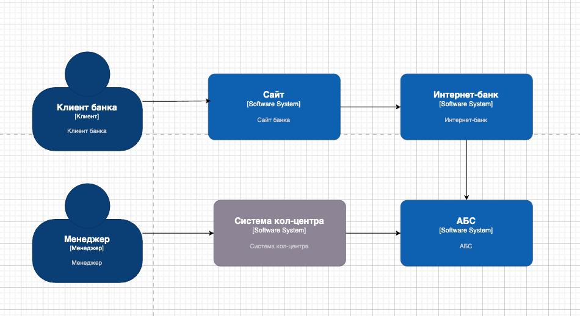
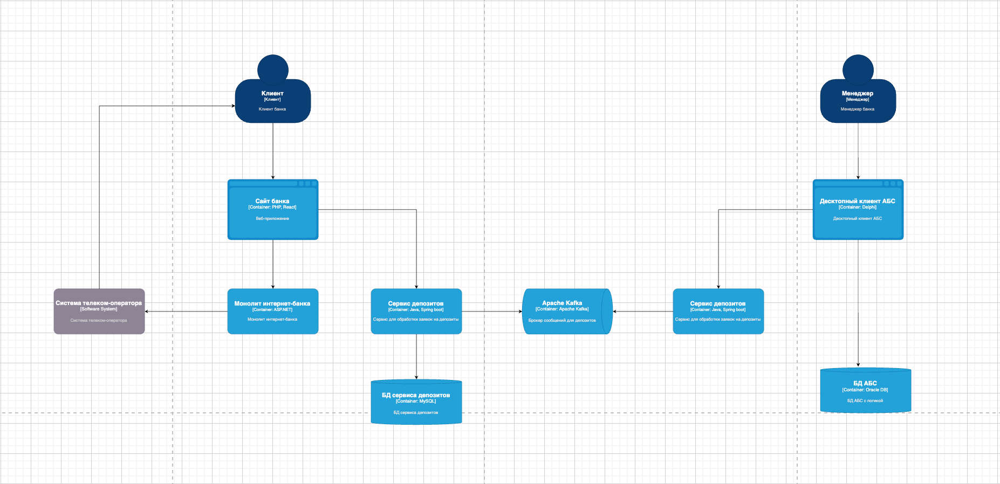

### **Название задачи:**

MVP открытия депозитов в интернет-банке и на сайте

### **Автор:**

Команда цифровой трансформации

### **Дата:**

23.03.2025

### **Функциональные требования**

Опишите здесь верхнеуровневые Use Cases. Их нужно оформить в виде таблицы с пошаговым описанием:

| **№** | **Действующие лица или системы** | **Use Case**                              | **Описание**                                                                                                         |
|:-----:|:---------------------------------|:------------------------------------------|:---------------------------------------------------------------------------------------------------------------------|
|   1   | Клиент                           | Подача заявки на депозит на сайте         | Клиент вводит ФИО, телефон, выбирает депозит → Система сохраняет данные → Менеджер кол-центра связывается с клиентом |
|   2   | Клиент                           | Подача заявки на депозит в интернет-банке | Клиент выбирает депозит, вводит сумму и счёт → Подтверждает операцию СМС-кодом → Бэк-офис обрабатывает заявку в АБС  |
|   2   | Клиент                           | Просмотр депозитов                        | Клиент может просматривать свой депозит                                                                              |
|   3   | Менеджер кол-центра              | Обработка заявки на сайте                 | Получает заявку в системе кол-центра → Связывается с клиентом → Обновляет статус заявки                              |
|   4   | Менеджер бэк-офиса               | Обработка заявки в АБС                    | Проверяет заявку → Подтверждает ставку → Открывает депозит в АБС                                                     |
|   5   | Система интернет-банка           | Отправка СМС-уведомления                  | После подтверждения депозита отправляется СМС клиенту                                                                |

### **Нефункциональные требования**

| **№** | **Требование**                                                        |
|:-----:|:----------------------------------------------------------------------|
|   1   | Шифрование данных при передаче между клиентом и сервером (HTTPS)      |
|   2   | Высокая доступность интернет-банка (99,9%)                            |
|   3   | Минимальное время отклика (< 1 сек)                                   |
|   4   | Интеграция с существующими системами банка (MS SQL, Oracle)           |
|   5   | Минимизация изменений в АБС                                           |
|   6   | Использование Kafka для асинхронной обработки данных (на перспективу) |
|   7   | Масштабируемость интернет-банка (горизонтальное масштабирование)      |
|   8   | Система должна выдерживать пиковые нагрузки без деградации            |
|   9   | Соответствие внутреннему UI-гайду банка                               |

### **Решение**

#### **Контекстная диаграмма**

**Описание:**

- Клиенты взаимодействуют с интернет-банком и сайтом.
- Интернет-банк передаёт данные в АБС.
- Кол-центр получает заявки с сайта и связывается с клиентами.

#### **Диаграмма контейнеров**

**Описание:**

- Интернет-банк включает фронтенд (React) и бэкенд (.NET, MS SQL).
- АБС — десктоп-клиент на Delphi с базой Oracle.
- Кол-центр работает на платформе подрядчика (Java, PostgreSQL).
- Все сервисы взаимодействуют через API и шины данных.

**Логика выбора технологий:**

- Используем MS SQL и Oracle для совместимости с текущей инфраструктурой.
- Ставки депозитов вынесены в отдельную базу данных для гибкости.
- Доработки АБС сведены к минимуму.
- Используем HTTPS для защиты данных клиента.

### </a>**Альтернативы**

1. **Хранение ставок депозитов в XLS-файлах** (текущая практика)
    - ❌ Неудобно для автоматизации
    - ✅ Простота внедрения
2. **Внедрение микросервисной архитектуры для интернет-банка**
    - ✅ Гибкость и масштабируемость
    - ❌ Высокая стоимость разработки и внедрения на данном этапе

### **Недостатки, ограничения, риски**

- ❗ **Ограничения АБС** — высокая нагрузка может привести к сбоям.
- ❗ **Доступность интернет-банка** — текущая архитектура не обеспечивает 99,9% uptime.
- ❗ **Зависимость от кол-центра** — заявки на сайте требуют обработки менеджерами.

---

Этот ADR описывает MVP открытия депозитов с учётом существующих ограничений. По мере развития архитектуры документация
будет обновляться.
